# meme-generator
Generate meme with Dalle + GPT-4o

Try out the [Web demo](https://huggingface.co/spaces/hermanda/meme-generator), integrated into [Huggingface Spaces 🤗](https://huggingface.co/spaces) using [Gradio](https://github.com/gradio-app/gradio). 

# How does it work?
This app uses langchain and `GPT-4o-mini` in the background.

```mermaid
graph LR
    A[Input meme seed] --> B[🤖 Generate image with Dalle] & C[🤖 Generate text with GPT-4o] --> D[Blend together into meme]
```


## Usage

### Local
```
uv venv --python=3.12
source .venv/bin/activate
uv pip install -r requirements.txt
python app.py
```
Now you can visit http://0.0.0.0:3000 and enjoy the app.

### Docker
```
docker build -t meme-generator .
docker run -p 3000:3000 --name meme-generator -e OPENAI_API_KEY=your_openai_api_key_here meme-generator-app
```
Now you can enjoy the app on http://localhost:3000. 

To remove the image
```
docker rm meme-generator
```
